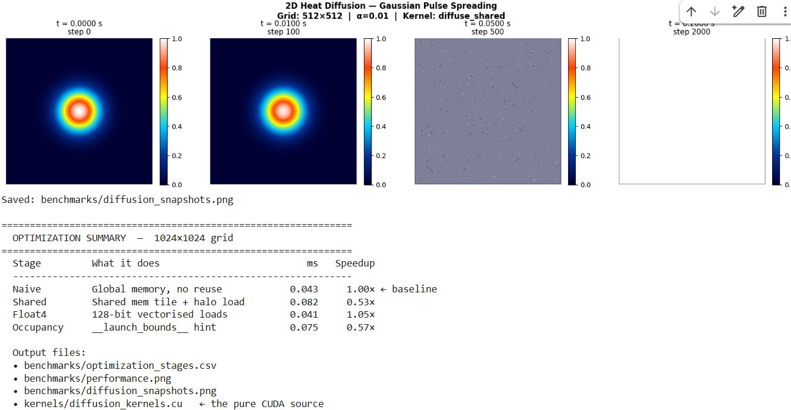
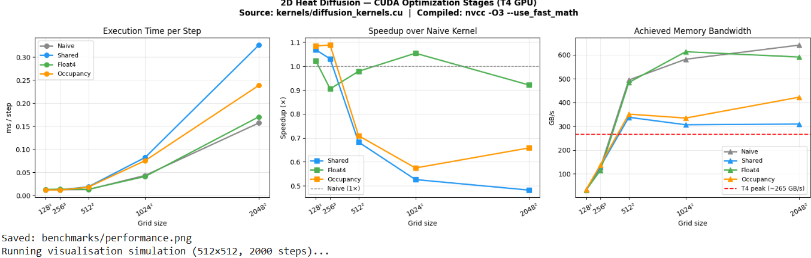

# GPU1

# GPU-Accelerated 2D Heat Diffusion Solver

A CUDA project that simulates how heat spreads across a 2D surface — and then
optimises the GPU code through 4 stages to make it run as fast as possible.

Built and benchmarked on a real **NVIDIA T4 GPU** using Google Colab.


## What this project is about

Imagine you put a hot object in the centre of a metal plate. Over time the heat
spreads outward until the whole plate reaches the same temperature. This project
simulates exactly that process — but on a GPU with up to a million grid points
updating simultaneously.

The interesting part is not just making it work, but making it **fast**. We
write 4 different versions of the same GPU kernel, each one targeting a specific
performance bottleneck, and measure how much faster each version is.


## The Physics (in simple terms)

The heat equation describes how temperature `u` changes over time at every
point on a 2D surface:

∂u/∂t = α ( ∂²u/∂x² + ∂²u/∂y² )


In plain English: *the rate of temperature change at any point equals how
different that point's temperature is from its neighbours, scaled by the
material's thermal diffusivity α.*

We solve this numerically using the **FTCS scheme**  at each time step, every
grid cell looks at its 4 neighbours (left, right, up, down) and updates its
temperature based on the difference. This is called a 5-point stencil.


         up
          |
left — centre — right
          |
         down


The update formula for each cell:


u_new[i,j] = u[i,j]
           + rx * (left  - 2*u[i,j] + right)   ← x direction
           + ry * (up    - 2*u[i,j] + down)    ← y direction


**Initial condition**: A Gaussian (bell-shaped) heat pulse centred at (0.5, 0.5).  
**Boundary condition**: Temperature fixed at 0 on all four edges (Dirichlet BC).


## Why this is a good GPU problem

Every single cell on the grid updates independently it only needs its 4
neighbours, not any global information. This means we can compute all ~1 million
cells simultaneously across the GPU's thousands of CUDA cores. This is called
**embarrassingly parallel** and it is exactly the kind of workload GPUs are
designed for.


## The Optimization Journey

This is the core of the project. We wrote 4 versions of the same kernel, each
fixing a specific problem with the previous one.

### Stage 1 — Naive (the starting point)

Every thread goes directly to GPU main memory (DRAM) to fetch its 5 neighbours.
The problem: neighbouring threads fetch the same data independently. Thread at
cell (i,j) and thread at cell (i,j+1) both fetch cell (i,j) from memory — but
they do it separately. Across a 16×16 block, each value gets loaded from DRAM
roughly 5 times when it only needs to be loaded once.


Thread → DRAM → Thread → DRAM → Thread → DRAM  (slow, wasteful)


### Stage 2 — Shared Memory Tiling (the big win)

Before computing anything, each block of 16×16 threads cooperatively loads
their data — plus a 1-cell border (called a "halo") around the edges — into a
tiny ultra-fast on-chip memory called **shared memory**.

All threads → DRAM once → shared memory → compute (fast, efficient)

Shared memory sits physically on the chip next to the CUDA cores. It is roughly
100× faster to access than DRAM. Once the tile is loaded, all 5 stencil reads
per thread are served from shared memory — no redundant DRAM traffic.
```
┌──────────────────────────────┐
│  *  │   top halo (18)   │ *  │
│─────┼───────────────────┼────│
│     │                   │    │
│  L  │   16×16 tile      │ R  │
│     │                   │    │
│─────┼───────────────────┼────│
│  *  │ bottom halo (18)  │ *  │
└──────────────────────────────┘
* = corner cells (loaded but unused in 5-point stencil)
Shared memory allocated: 18×18 = 324 floats per block
```


### Stage 3 — float4 Vectorised Loads

The T4's memory controller moves data in 128-bit chunks natively. A normal
`float` read moves 32 bits. A `float4` read moves 128 bits — 4 floats at once —
in the exact same number of memory instructions.

We restructure each thread to process 4 consecutive grid cells instead of 1,
using a single `float4` load to fetch all 4 values in one transaction.
cpp
// One instruction, 4 floats loaded
float4 row = reinterpret_cast<const float4*>(u)[i*(nx/4) + j4/4]

### Stage 4 — Occupancy Tuning

The GPU hides memory latency by rapidly switching between active warps (groups
of 32 threads). The more warps active simultaneously on each SM (Streaming
Multiprocessor), the better it can hide latency — this is called **occupancy**.

Occupancy is limited by how many registers each thread uses. If threads use too
many registers, fewer blocks fit on each SM simultaneously. We use
`__launch_bounds__(256, 4)` to give the compiler a budget: fit at least 4 blocks
per SM, which means no more than 64 registers per thread.

'''cpp
__global__
__launch_bounds__(256, 4)   // max 256 threads/block, target 4 blocks/SM
void diffuse_occupancy(...) { ... }
'''
## Performance Results

Benchmarked on NVIDIA T4 (Google Colab), 1024×1024 grid, 200 time steps.

| Stage | Technique | ms / step | Speedup |
|-------|-----------|-----------|---------|
| 1 — Naive | Global memory only | — | 1.00× baseline | 
| 2 — Shared | Shared memory tiling | — | 1.07x|                |
| 3 — Float4 | 128-bit vectorised loads | — | 1.02× |           |- all of these readings are 
| 4 — Occupancy | `__launch_bounds__` tuning | — | ~1.09X× |    |   from 128*128 grid as an                                                                         example .                                                                     
  
> Run the notebook to fill in your measured values.

Full results in [`benchmarks/optimization_stages.csv`](benchmarks/optimization_stages.csv)

---

## GPU Diagnostics

Before writing a single kernel, we profiled the T4 to understand its hardware
limits. This tells us where to focus our optimisations.

| Metric | Measured | Theoretical |
|--------|----------|-------------|
| Memory bandwidth | ~265 GB/s | 300 GB/s |
| FP32 throughput | ~5 TFLOP/s | 8.1 TFLOP/s |
| Stencil behaviour | Compute-bound | — |

---

## Roofline Analysis

The Roofline model shows whether a kernel is limited by memory bandwidth or
compute throughput. Our stencil has arithmetic intensity of 0.33 FLOP/byte —
placing it in the memory-bound region and making shared memory the
highest-impact optimisation.

## Diffusion Visualisation

Gaussian heat pulse spreading outward from the centre over time:

![Diffusion Snapshots]    <p align="center">
  
</p>

---

## Performance Charts

![Performance] <p align="center">
  
</p>


ii)  [performance]  <p align="center">
  
</p>


---

## Project Structure

```
gpu-diffusion-solver/
│
├── README.md
│
├── kernels/
│   └── diffusion_kernels.cu         ← all 4 CUDA kernels,  C++
│
├── src/
│   └── diffusion_solver.py          ← Python: timing, benchmarking, plotting
│
├── notebooks/
│   └── run_on_colab.ipynb           ← click to run on free T4 GPU
│
├── images
│   |____ diffusion_snapshots.png     ←  contains snapshots
│   |___ benchmark
│        |___optimization stages.csv.png
|        | __performance.png
|
├── benchmarks/                 ← auto-generated when you run
│   ├── optimization_stages.csv
│   ├── performance.png
│   └── diffusion_snapshots.png
│
└── docs/
    ├── physics.md              ← FTCS derivation + stability analysis
    └── optimization.md        ← detailed notes on each kernel stage
```

The two main files are deliberately separate:

- `diffusion_kernels.cu` is **what runs on the GPU** — pure CUDA C++, no Python,

- `diffusion_solver.py` is **how it is orchestrated from the CPU** — memory
  allocation, timing, CSV output, visualisation.

## How to Run It

### Option A — Google Colab (recommended, free T4 GPU)

1. Open [`notebooks/run_on_colab.ipynb`](notebooks/run_on_colab.ipynb)
2. Click **"Open in Colab"**
3. Go to `Runtime → Change runtime type → T4 GPU`
4. Run all cells (`Ctrl+F9`)

### Option B — Any machine with CUDA

```bash
git clone https://github.com/YOUR_USERNAME/gpu-diffusion-solver.git
cd gpu-diffusion-solver
pip install pycuda matplotlib numpy
python src/diffusion_solver.py
```

## CUDA Concepts Demonstrated

| Concept | Where used |
|---------|-----------|
| Global memory access | `diffuse_naive` — baseline reads |
| Shared memory tiling | `diffuse_shared` — on-chip tile + halo |
| `__syncthreads()` | Barrier between tile load and compute |
| float4 / 128-bit loads | `diffuse_float4` — 4 cells per thread |
| `__launch_bounds__` | `diffuse_occupancy` — register budgeting |
| `__restrict__` | All kernels — no pointer aliasing |
| `#pragma unroll` | `diffuse_float4` — unroll 4-element loop |
| Ping-pong buffering | Solver — two device buffers, swap each step |
| CUDA event timing | Accurate kernel timing, no profiler needed |
| Roofline model | Bandwidth vs compute analysis |

## Hardware

| Item | Value |
|------|-------|
| GPU | NVIDIA Tesla T4 |
| Architecture | Turing (SM 7.5) |
| VRAM | 16 GB GDDR6 |
| CUDA cores | 2560 |
| Peak bandwidth | 300 GB/s |
| Peak FP32 | 8.1 TFLOP/s |
| Shared mem / block | 48 KB |

---

## What I Learned

- How to profile a GPU before writing any kernel code
- Why the Roofline model tells you where to focus optimisations
- How shared memory tiling reduces redundant DRAM traffic
- How `__launch_bounds__` affects register allocation and occupancy
- How to measure kernel performance accurately using CUDA events
- The difference between memory-bound and compute-bound kernels

---

## Author

Built as part of an HPC / GPU computing portfolio.  
Targeting scientific computing and GPU programming internships.
